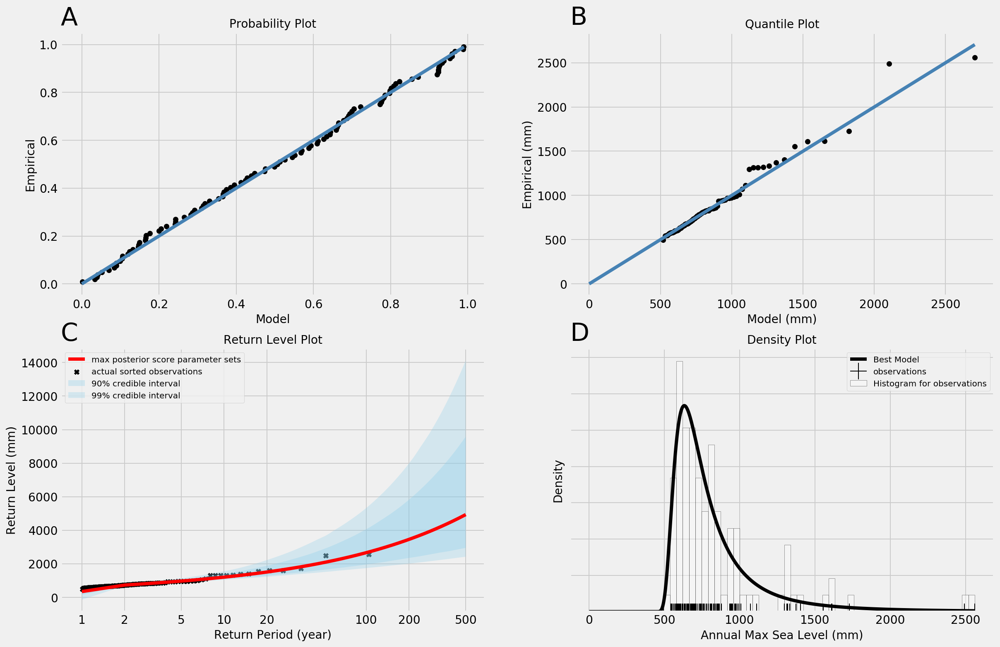

# Summary
Robust management of coastal risks demands projections of flood hazards that account for a wide variety of potential sources of uncertainty. Two typical approaches for estimating flood hazards include (1) direct physical process-based modeling of the storms themselves, and (2) statistical modeling of the distributions and relevant characteristics of extreme sea level events. Recently, flexible and efficient mechanistically-motivated models for sea-level change have become widely used for characterizing uncertainty in projections of mean sea levels [@Oppenheimer2016]. This creates a need for similarly efficient methods for estimating the hazards posed by extreme sea levels, and motivates the focus of ``SSPipeline`` (Storm Surge Pipeline) package on characterizing uncertainty in estimates of extreme sea levels using a statistical modeling approach. Specifically, ``SSPipeline`` processes raw sea level data and fits a statistical distribution to the extreme sea levels, which permits estimation of the probabilities associated with extreme sea levels.

``SSPipeline`` satisfies the demand for fast estimation of flood hazard and characterization of uncertainty in several ways. First, the ``SSPipeline`` API is designed in such a way that a user only needs to configure a text file, which includes arguments for the tide gauge data set to be used and some statistical modeling and output options, and runs from a single terminal command the suite of calibration and diagnostic routines. These result in a set of diagnostic plots and data sets of calibrated parameter and storm surge return level estimates. Second, the ``SSPipeline`` is modular, so developers can extend the options for statistical model
or the calibration method employed if they so choose.

``SSPipeline`` begins with a raw tide gauge data set for hourly sea levels, formatted in the manner of the University of Hawaii Sea Level Center (UHSLC) data repository in CSV format [@Waldwell2015]. This choice is motivated by the fact that the UHSLC repository provides hundreds of widely used, freely available and research-quality hourly sea level data sets, spread across the globe. The user configuration file designates the location of this data set, as well as a number of data processing options to establish the processed data set that will serve as calibration data to which we fit a distribution. At present, a generalized extreme value (GEV) distribution fit to annual block maximum sea levels is the only option, as it is both commonly used in the literature [REFS] and the proper limiting distribution for a sequence of block maxima [@Coles2001]. Future code enhancements will include adding options for other statistical models, for example, generalized Pareto or lognormal distributions. The GEV distribution is specified by three parameters: a location parameter which governs the center of the distribution ($\mu$), a scale parameter which governs the width of the distribution ($\sigma$) and a shape parameter which governs the weight of the upper tail ($\xi$). These three parameters are estimated using a Markov chain Monte Carlo parameter calibration approach to sample from the posterior distribution of the model parameters given the processed tide gauge data set [@Higdon2004]. In this calibration approach, the goodness-of-fit of the GEV distribution given by a candidate set of parameters is quantified by comparing the modeled probability of a given storm surge height against the observed probabilities from the tide gauge data. The user configuration file also specifies a variety of settings for the calibration method, including the number of parallel Markov chains to use for estimation, number of iterations to simulate and thresholds for autocorrelation and convergence of the Markov chains.

The final output from ``SSPipeline`` includes a data set of GEV posterior parameter samples, data tables of flood heights and associated probabilities and a set of figures to assess model goodness-of-fit and the estimated flood probabilities. Figure 1 provides an example of this diagnostic figure set, including: (1A) a probability plot, where each data point corresponds to an observed sea level extreme, the x-value gives the modeled probability of observing that sea level in a given year, and the y-value gives the empirical probability of observing that sea level in a given year; (1B) a quantile plot, which shows the model-estimated sea levels (x-axis) associated with the observed sea levels (y-axis); (1C) a return levels plot, which shows the storm surge heights ("return levels", y-axis) associated with given return periods (how frequently one expects to observe such a storm, x-axis); and (1D) the best-fit GEV distribution, superimposed on the processed tide gauge data.

The modular nature of the ``SSPipeline`` codes will facilitate the addition of new features and extensions of the base codes, including options to fit alternative statistical models and projecting future flood hazard by incorporating potential nonstationary processes into the model [@Wong2018]. By providing a base of code to the community, our aim is to (1) enable others to incorporate more modeling uncertainties into their own flood hazard estimates, (2) provide a foundation on which a user community might work together to develop extensions on the existing codes, and (3) provide a pipeline with standard output diagnostics to facilitate comparisons of the extensions and features that users may add over time. This, in turn, will lead to a more complete understanding and careful accounting of the impacts of various uncertainties and processes that affect flood hazard estimates.

# Acknowledgements
We thank Klaus Keller for fruitful conversations and XXX for feedback on early
versions of the codes.

# References
