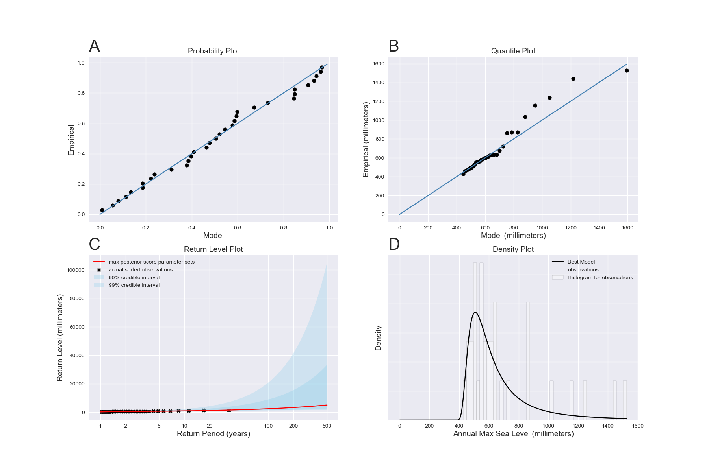

# SSPipeline Example

## Motivation

We at MUSSLES thought that it would be extremely useful, for the user, if there was a demo of a real world application of our SSPipeline package. So, we have put together an example which runs on the [Grand Isle, Louisiana, USA](https://uhslc.soest.hawaii.edu/rqds/atlantic/doc/qa765a.dmt) data set from the University of Hawaii Sea Level Center (UHSLC). We chose this data set because not only does it barely have any gaps, but it also only takes roughly 5 minutes to run the data set through the pipeline on an average computer.

## Directory Structure

./

- the SSPipeline Example "home" directory

./configs/

- home of the different configuration files for the example

./data/

- directory for the data set

./output/

- output directory for the example

## Usage

The [`bootstrap.sh`](bootstrap.sh) file is the script that you will want to run everything from. To see exactly what this script does, you can run the following to get the usage message:

```sh
bash bootstrap.sh --help
```

## Results

**Diagnostic Plots:** [link](output/plots/diagnostic_plots.png)



**Other Plots:** [link to folder](output/plots)

- [ACF Function](output/plots/acf_function.png)
- [Annual Maximum](output/plots/annual_maximum.png)
- [Cleaned Data](output/plots/cleaned_data.png)
- [GR Diagnostic](output/plots/gr_diagnostic.png)
- [History Plots](output/plots/history_plots.png)
- [Parameter Pool](output/plots/params_pool.png)

**Calibrated Parameters:** [link to folder](output/parameters)

- [Parameter 1](output/parameters/parameter-1.txt)
- [Parameter 2](output/parameters/parameter-2.txt)
- [Parameter 3](output/parameters/parameter-3.txt)

**Return Levels:** [link](output/return_levels.csv)

**Log:** [link](output/sspipeline.log)
