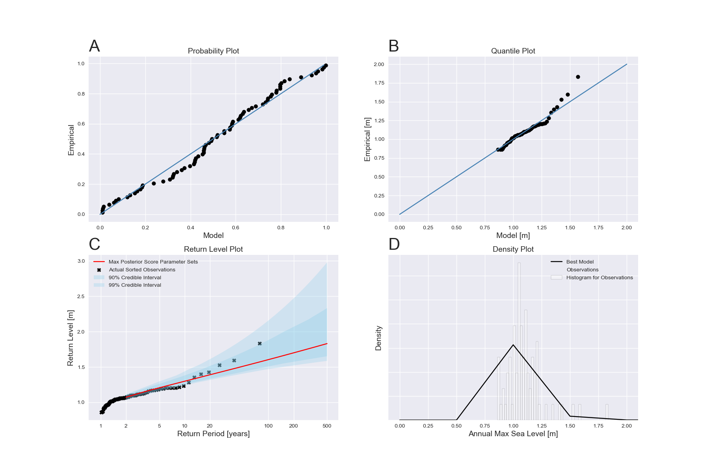
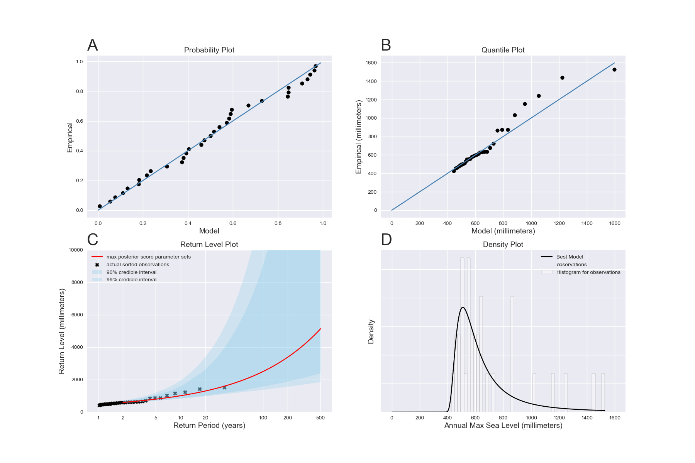

# SSPipeline Example

## Motivation

We thought that it would be extremely useful if there was a demo for our SSPipeline package. So, we have put together an example which uses the [Wilmington, North Carolina, USA](https://uhslc.soest.hawaii.edu/rqds/atlantic/doc/qa750a.dmt) and [Grand Isle, Louisiana, USA](https://uhslc.soest.hawaii.edu/rqds/atlantic/doc/qa765a.dmt) datasets from the University of Hawaii Sea Level Center (UHSLC). Please note that this example only takes roughly 5-6 minutes to run on your average computer (roughly 2-3 minutes per dataset)!

## Directory Structure

./

- example "home" directory

./configs/

- home of the different configuration files for the example

./data/

- directory for the data set used in the example

./output/

- output directory for the example

## Usage

The [`bootstrap.sh`](bootstrap.sh) file is the script that you will want to run everything from. To see exactly what this script does, you can run the following to get the usage message:

```sh
bash bootstrap.sh --help
```

If you want to just solely run the example:

```sh
bash bootstrap.sh run
```

Note that if you want to play around with the parameters with which the example uses to fit the data set, check out this [file](configs/config.json). See more in the [Customization](#customization) section.

## Customization

A full blown configuration file for SSPipeline should look something along the lines of:

```json
{
  "adaption": 300,
  "data": "data/h765a.csv",
  "iterations": 3000,
  "output_dir": "output",
  "percentage": 0.9,
  "plot": 1,
  "sequences": 3,
  "transition": [10, 2, 0.01],
  "verbose": 1
}
```

You can change all of these configurations to fit your preferences, however, some of them have a more drastic effect on your output than others do. TODO

## Results

### Wilmington, North Carolina, USA

**Diagnostic Plots:** [link](output/h750a/plots/diagnostic_plots.png)



**Other Plots:** [link to folder](output/h750a/plots)

- [ACF Function](output/h750a/plots/acf_function.png)
- [Annual Maximum](output/h750a/plots/annual_maximum.png)
- [Cleaned Data](output/h750a/plots/cleaned_data.png)
- [GR Diagnostic](output/h750a/plots/gr_diagnostic.png)
- [History Plots](output/h750a/plots/history_plots.png)
- [Parameter Pool](output/h750a/plots/params_pool.png)

**Calibrated Parameters:** [link to folder](output/h750a/parameters)

- [Parameter 1](output/h750a/parameters/parameter-1.txt)
- [Parameter 2](output/h750a/parameters/parameter-2.txt)
- [Parameter 3](output/h750a/parameters/parameter-3.txt)

**Return Levels:** [link](output/h750a/return_levels.csv)

**Log:** [link](output/h750a/sspipeline.log)

### Grand Isle, Louisiana, USA

**Diagnostic Plots:** [link](output/h765a/plots/diagnostic_plots.png)



**Other Plots:** [link to folder](output/h765a/plots)

- [ACF Function](output/h765a/plots/acf_function.png)
- [Annual Maximum](output/h765a/plots/annual_maximum.png)
- [Cleaned Data](output/h765a/plots/cleaned_data.png)
- [GR Diagnostic](output/h765a/plots/gr_diagnostic.png)
- [History Plots](output/h765a/plots/history_plots.png)
- [Parameter Pool](output/h765a/plots/params_pool.png)

**Calibrated Parameters:** [link to folder](output/h765a/parameters)

- [Parameter 1](output/h765a/parameters/parameter-1.txt)
- [Parameter 2](output/h765a/parameters/parameter-2.txt)
- [Parameter 3](output/h765a/parameters/parameter-3.txt)

**Return Levels:** [link](output/h765a/return_levels.csv)

**Log:** [link](output/h765a/sspipeline.log)
